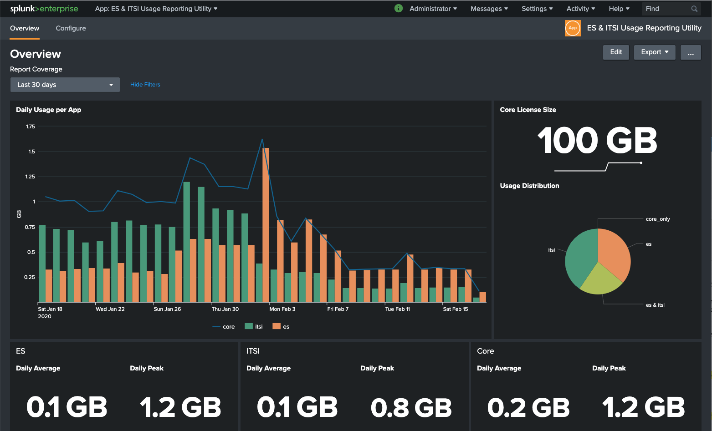
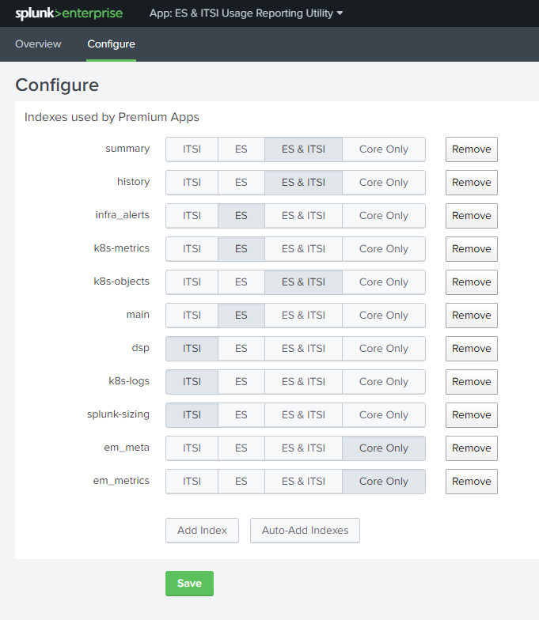

# ES / ITSI Usage Reporting

This app allows you to create a simple report on daily ES / ITSI usage in Splunk based on selected indexes. Admin can select which indexes are used for each premium app, and the app will summarize it.

## Requirements
The searches in the dashboard are accessing **_internal** licence_usage logs. The app will only work on a search head which has access to the _internal logs on the **license master**. It also would need to have access to the indexes in order to create a selection list. User has to be assigned to a role with access to the _internal indexes. 

You may check if you see results with following search: 
    `index=_internal source=*license_usage.log* type="Usage"`

## Usage

Install the app, use "configure" page to assign indexes used for ES or ITSI. The page will display all indexes on first usage or by clicking "Auto Add Indexes" button. 

If you prefer you may also add a comma separated list (only comma, no space) to the following stanza in local/app.conf:

[reporting]
itsi_indexes = 
es_indexes = 
core_only_indexes = 

## Support

This app is not officially supported by Splunk.

## License

[Apache License 2.0](LICENSE.md)
